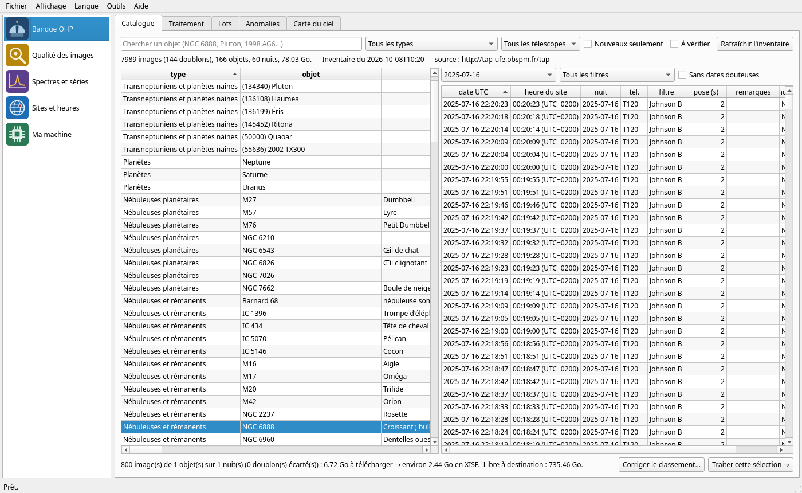

<p align="center"></p>

# Coupole

**Français** · [English](#english)

Boîte à outils **libre** (GPL-3.0) pour les étudiants du DU « Explorer et Comprendre l'Univers » (DU ECU) de
l'Observatoire de Paris. Python 3.10+, interface graphique PyQt6 **et** ligne de commande complète, en français et en
anglais, sur Windows, macOS et Linux. Architecture **modulaire** : d'autres modules viendront au fil de l'année
(simulateurs, exercices, radioastronomie...).

| Module | Ce qu'il fait |
|---|---|
| **Banque OHP** | Récupère la banque d'images « OHP student observations » (T120 et IRIS, 7 989 images, 78 Go) par le service TAP public de l'Observatoire ; catalogue des 166 objets ; téléchargement avec reprise ; doublons écartés (et expliqués) ; solution astrométrique contrôlée (ASTAP facultatif) ; en-têtes corrigés avec traçabilité ; conversion **XISF** (PixInsight), **FITS compressé sans perte** (`.fits.fz` : Siril, astropy) ou FITS float32 ; tri en **lots empilables** avec fiche `LOT.txt` ; carte du ciel ; rapport d'anomalies. |
| **Qualité des images** | Facultatif : FWHM, ellipticité (carte 3 × 3), fond, bruit, gradient, saturation, traînées, échantillonnage — mesures validées sur images synthétiques. |
| **Spectres et séries** | Lecture et tracé de données 1D (spectres H I à 21 cm avec axe fréquence ↔ vitesse radio, courbes de lumière, tables FITS ou CSV). |
| **Sites et heures** | Sites d'observation (MPC), carte OpenStreetMap, heure UTC et heure locale du site. |
| **Ma machine** | Diagnostic matériel et parallélisme retenu (exemple minimal de module). |

<p align="center"></p>

### Installer

**Paquets tout compris** (rien d'autre à installer, mise à jour automatique) — page *Releases* du dépôt :

| Système | Fichier | Installation |
|---|---|---|
| Windows 10/11 64 bits | `Coupole-Setup-x.y.z.exe` | double-clic ; « Informations complémentaires » puis « Exécuter quand même » au premier lancement (installeur non signé) ; aucun mot de passe administrateur |
| macOS Apple Silicon / Intel | `Coupole-x.y.z-macos-arm64.dmg` / `-x86_64.dmg` | glisser dans Applications ; premier lancement : clic droit, « Ouvrir » |
| Linux x86_64 / ARM64 | `Coupole-x.y.z-linux-x86_64.tar.gz` | décompresser, lancer `installer.sh` (dans `~/.local/share`, entrée de menu) |

**Avec le Python de l'ordinateur** (≥ 3.10) — depuis le dossier des sources :

```bash
sh install.sh          # Linux, macOS : environnement virtuel, dépendances, lanceurs ; Entrée pour confirmer
install.bat            # Windows (double-clic) : idem, raccourcis Bureau et menu Démarrer
```

**Pour les habitués de Python** :

```bash
pipx install git+https://github.com/ARP273-ROSE/coupole        # ou : pip install .
pip install ".[qualite]"                                        # + module Qualité (SEP)
python -m coupole            # interface ;   coupole --help : ligne de commande
```

### En deux minutes

```bash
coupole ohp catalogue --type neb                       # les nébuleuses de la banque
coupole ohp estimer "NGC 6888" --nuit 2025-07-16      # 800 images, 6,72 Go → 2,44 Go en XISF
coupole ohp traiter "(914) Palisana" --dest ~/OHP      # télécharge, vérifie, corrige, convertit, range
coupole ohp anomalies --csv anomalies.csv              # ce qui est écarté, et pourquoi
coupole qualite ~/OHP --ecrire                         # QUALITE.csv et QUALITE.txt par lot
coupole --lang en ohp catalog                           # tout existe aussi en anglais
```

Tout ce que fait l'interface se fait en ligne de commande (`--json` pour les scripts). Le traitement est
**reprenable** : relancer la même commande reprend là où il s'était arrêté.

### Pourquoi XISF par défaut (et quand préférer autre chose)

| Format | Pour | Détail |
|---|---|---|
| **XISF** (défaut) | PixInsight | Float32 en ADU avec `bounds="-1000:65535"` (rien à régler à l'ouverture, même échelle pour toutes les poses), UInt16 pour les FITS IRIS entiers ; compression zstd+sh niveau 9 : 36 % du FITS d'origine pour le T120. |
| **FITS compressé `.fits.fz`** | Siril, astropy, DS9 | Compression par tuiles du standard FITS, **sans perte** : GZIP_2 sans quantification pour les flottants (RICE_1 et HCOMPRESS quantifient : vérifié, écart d'un ADU), RICE_1 pour les entiers. |
| **FITS float32** | tout logiciel | Non compressé ; dans PixInsight, régler la plage FITS sur 0–65535 (Truncate). |

Chaque fichier écrit est relu et comparé pixel à pixel ; l'écart au FITS d'origine (float64 du T120) reste sous le
demi-ULP du float32 (≤ 0,016 ADU).

### ASTAP (facultatif)

Sans ASTAP, Coupole fait **tout** : contrôles de cohérence de la solution astrométrique existante (échelle, angle,
centre), en-têtes, lots, conversion. ASTAP ajoute la **vérification indépendante** de chaque solution (et la
réfection d'une solution fausse). L'assistant (menu *Outils*, ou `coupole astap --guide`) indique le bon paquet pour
le système et l'architecture détectés (Windows x64/ARM64, macOS Intel/Apple Silicon, Linux deb/rpm/Arch/archive,
x86_64/arm64), le catalogue conseillé — **D80** (≈ 1,2 Go) : les champs de la banque (10,7′ à 31′) sont sous le seuil
de 0,6° du site officiel, qui indique que les catalogues denses conviennent aux petits champs ; D50 convient aussi pour
IRIS — avec les liens officiels (www.hnsky.org/astap.htm), puis détecte ASTAP et son catalogue (emplacements par
défaut, PATH, variables `COUPOLE_ASTAP` et `COUPOLE_ASTAP_CATALOGUE`, choix manuel) et vérifie version et complétude
(1 476 tuiles).

### La carte graphique

Elle est détectée et affichée (NVIDIA, AMD, Intel, Apple), mais **le module Banque OHP ne l'utilise pas** : son
travail est limité par le réseau, le disque et la compression Zstandard (processeur). L'API `coupole.core.calcul`
permet aux modules futurs d'utiliser CuPy (facultatif) quand c'est utile. Le parallélisme, lui, s'adapte à la
machine : téléchargements 3 (4 au plus, serveur public, débit plafonné à 8 Mo/s), conversions = cœurs physiques − 1
bornées par la mémoire disponible (≈ 500 Mo par conversion d'image IRIS 4096²), mode économe automatique sous 4 Go
ou 2 cœurs, bridage manuel possible.

### Rapports d'incident et mises à jour

Au premier lancement, Coupole demande s'il peut envoyer des rapports **anonymes** en cas de plantage (version,
système, processeur, mémoire, trace d'erreur aux chemins tronqués ; jamais de nom de machine, d'utilisateur ni
d'image). Sans accord, rien ne part. Les paquets se mettent à jour d'eux-mêmes depuis les Releases GitHub (archive
du code seulement, aucun exécutable téléchargé) ; une installation par pip/pipx indique la commande à lancer.

### Évolutif

Adresses des services dans `coupole/donnees/sources.json` (modifiables dans les Préférences ou `coupole sources`,
mises à jour par le fichier publié dans le dépôt, contrôle de forme et liste blanche de domaines) ; table de
classement des cibles en JSON, corrections mémorisées, nouveaux noms classés par règles, résolution en ligne
facultative (JPL SBDB, CDS Sesame) et regroupement par position ; nouveautés de la base signalées à chaque
rafraîchissement ; colonnes ObsCore, instruments et filtres nouveaux tolérés.

### Documentation

- Manuel de référence : `coupole/docs/manuel_fr.pdf` (menu *Aide* > *Manuel*, ou `coupole manuel`).
- Écrire un module, ajouter un format : [CONTRIBUTING.md](CONTRIBUTING.md). Historique : [CHANGELOG.md](CHANGELOG.md).

### Sources et crédits

Données : banque « OHP student observations », Observatoire de Paris / PADC (Paris Astronomical Data Centre),
service TAP public, licence Etalab 2.0. Méthode de traitement : guide officiel de la base (PADC-BDD-DU-ECU) et
inventaire de la banque de l'auteur. Format XISF : spécification de Pleiades Astrophoto. ASTAP : Han Kleijn
(www.hnsky.org), non inclus. SEP : Source Extractor en Python (LGPL). Cartes : © OpenStreetMap contributors.
Auteur : ARP273-ROSE. Licence : GNU GPL version 3 ou ultérieure.

---

<a id="english"></a>
## English

**Free** (GPL-3.0) toolbox for students of the « Explorer et Comprendre l'Univers » university diploma (DU ECU) of
the Observatoire de Paris. Python 3.10+, PyQt6 graphical interface **and** a complete command line, in French and
English, on Windows, macOS and Linux. **Modular** architecture: more modules will come during the year.

| Module | What it does |
|---|---|
| **OHP image bank** | Fetches the « OHP student observations » bank (T120 and IRIS, 7,989 images, 78 GB) through the Observatory's public TAP service; catalogue of 166 objects; resumable downloads; duplicates left out (and explained); astrometric solution checked (ASTAP optional); headers fixed with traceability; **XISF** (PixInsight), **lossless compressed FITS** (`.fits.fz`: Siril, astropy) or float32 FITS output; sorting into **stackable sets** with a `LOT.txt` sheet; sky map; anomaly report. |
| **Image quality** | Optional: FWHM, ellipticity (3 × 3 map), background, noise, gradient, saturation, trails, sampling — measurements validated on synthetic images. |
| **Spectra and series** | Reading and plotting 1D data (21 cm H I spectra with frequency ↔ radio velocity axis, light curves, FITS or CSV tables). |
| **Sites and times** | Observing sites (MPC), OpenStreetMap map, UTC and site local time. |
| **My computer** | Hardware diagnosis and chosen parallelism (minimal example module). |

### Installing

**All-inclusive packages** (nothing else to install, automatic updates) — repository *Releases* page:
`Coupole-Setup-x.y.z.exe` (Windows 10/11 64-bit; « More info » then « Run anyway » on first launch; no
administrator password), `Coupole-x.y.z-macos-arm64.dmg` / `-x86_64.dmg` (first launch: right click, « Open »),
`Coupole-x.y.z-linux-x86_64.tar.gz` / `-arm64` (unpack, run `installer.sh`).

**With the computer's Python** (≥ 3.10), from the source folder: `sh install.sh` (Linux, macOS) or `install.bat`
(Windows) — virtual environment, dependencies, launchers; press Enter to confirm.

**For Python users**: `pipx install git+https://github.com/ARP273-ROSE/coupole` (or `pip install .`);
`pip install ".[qualite]"` adds the Quality module; `python -m coupole` starts the interface, `coupole --help`
the command line.

### In two minutes

```bash
coupole --lang en ohp catalog --type neb
coupole --lang en ohp estimate "NGC 6888" --night 2025-07-16
coupole --lang en ohp process "(914) Palisana" --dest ~/OHP
coupole --lang en ohp anomalies --csv anomalies.csv
coupole --lang en qualite ~/OHP --write
```

Everything the interface does is available on the command line (`--json` for scripts); processing is
**resumable**.

### Output formats

**XISF** (default, PixInsight): Float32 in ADU with `bounds="-1000:65535"` (nothing to set when opening, same scale
for every exposure), UInt16 for integer IRIS FITS; zstd+sh level 9 compression (36 % of the original T120 FITS).
**`.fits.fz`** (Siril, astropy, DS9): FITS tile compression, **lossless** — GZIP_2 without quantization for floats
(RICE_1 and HCOMPRESS quantize: checked, one-ADU error), RICE_1 for integers. **float32 FITS**: universal,
uncompressed. Every file written is read back and compared pixel by pixel.

### ASTAP (optional)

Without ASTAP, Coupole does **everything**: consistency checks of the existing astrometric solution, headers, stacks,
conversion. ASTAP adds an **independent check** of each solution. The assistant (*Tools* menu, or
`coupole astap --guide`) gives the right package for the detected system and architecture, the recommended catalogue
(**D80**, ≈ 1.2 GB; D50 also suits IRIS) with the official links (www.hnsky.org/astap.htm), then detects ASTAP and its
catalogue (default locations, PATH, `COUPOLE_ASTAP` / `COUPOLE_ASTAP_CATALOGUE`, manual choice) and checks version and
completeness.

### Graphics card

Detected and shown, but **not used by the OHP bank module** (its work is bound by network, disk and Zstandard
compression on the processor). The `coupole.core.calcul` API lets future modules use CuPy (optional). Parallelism
adapts to the computer (downloads: 3, at most 4, rate capped at 8 MB/s; conversions: physical cores − 1, bounded by
available memory; automatic economy mode below 4 GB or 2 cores; manual limits).

### Incident reports and updates

At first launch Coupole asks whether it may send **anonymous** crash reports; without consent nothing is sent.
Packages update themselves from GitHub Releases (code archive only, no executable downloaded); a pip/pipx installation
shows the command to run.

### Documentation, sources, credits

Reference manual: `coupole/docs/manuel_en.pdf` (*Help* > *Manual*, or `coupole manual`). Writing a module, adding a
format: [CONTRIBUTING.md](CONTRIBUTING.md). History: [CHANGELOG.en.md](CHANGELOG.en.md).
Data: « OHP student observations », Observatoire de Paris / PADC, public TAP service, Etalab 2.0 licence. XISF:
Pleiades Astrophoto specification. ASTAP: Han Kleijn (www.hnsky.org), not included. SEP (LGPL). Maps: ©
OpenStreetMap contributors. Author: ARP273-ROSE. Licence: GNU GPL version 3 or later.
